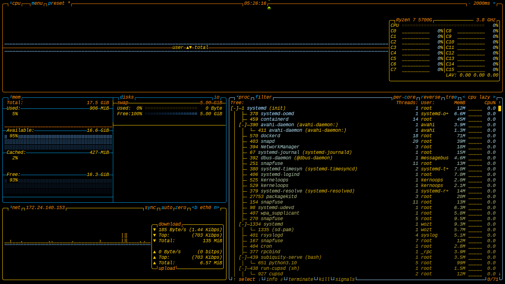

# btopthemes
Btop themes made by windsurf AI

# Install
Installez-les en copiant les fichiers dans le dossier de thèmes approprié (par exemple `/home/user/.config/btop/themes/` sur Ubuntu).

# Themes screenshots

Les captures sont attendues dans le dossier `./screenshots/` (fichiers nommés `<theme>.png`, sans le suffixe `.theme`).

---

<table>
  <!-- Row 1 -->
  <tr>
    <td align="center" width="50%">
      <figure>
        
        <figcaption><strong>applfresh</strong></figcaption>
      </figure>
    </td>
    <td align="center" width="50%">
      <figure>
        
        <figcaption><strong>articforest</strong></figcaption>
      </figure>
    </td>
  </tr>

  <!-- Row 2 -->
  <tr>
    <td align="center">
      <figure>
        
        <figcaption><strong>articsilver</strong></figcaption>
      </figure>
    </td>
    <td align="center">
      <figure>
        
        <figcaption><strong>blackandwhitecity</strong></figcaption>
      </figure>
    </td>
  </tr>

  <!-- Row 3 -->
  <tr>
    <td align="center">
      <figure>
        
        <figcaption><strong>bloodred</strong></figcaption>
      </figure>
    </td>
    <td align="center">
      <figure>
        
        <figcaption><strong>bubblegum</strong></figcaption>
      </figure>
    </td>
  </tr>

  <!-- Row 4 -->
  <tr>
    <td align="center">
      <figure>
        
        <figcaption><strong>diamondpearllegend</strong></figcaption>
      </figure>
    </td>
    <td align="center">
      <figure>
        
        <figcaption><strong>electricblue</strong></figcaption>
      </figure>
    </td>
  </tr>

  <!-- Row 5 -->
  <tr>
    <td align="center">
      <figure>
        
        <figcaption><strong>electricfushia</strong></figcaption>
      </figure>
    </td>
    <td align="center">
      <figure>
        
        <figcaption><strong>fierysunset</strong></figcaption>
      </figure>
    </td>
  </tr>

  <!-- Row 6 -->
  <tr>
    <td align="center">
      <figure>
        
        <figcaption><strong>forestwhisper</strong></figcaption>
      </figure>
    </td>
    <td align="center">
      <figure>
        
        <figcaption><strong>gamecubelegacy</strong></figcaption>
      </figure>
    </td>
  </tr>

  <!-- Row 7 -->
  <tr>
    <td align="center">
      <figure>
        
        <figcaption><strong>gbgreen</strong></figcaption>
      </figure>
    </td>
    <td align="center">
      <figure>
        
        <figcaption><strong>goldnight</strong></figcaption>
      </figure>
    </td>
  </tr>

  <!-- Row 8 -->
  <tr>
    <td align="center">
      <figure>
        
        <figcaption><strong>goldsilverluxury</strong></figcaption>
      </figure>
    </td>
    <td align="center">
      <figure>
        
        <figcaption><strong>hyrule</strong></figcaption>
      </figure>
    </td>
  </tr>

  <!-- Row 9 -->
  <tr>
    <td align="center">
      <figure>
        
        <figcaption><strong>jungleclover</strong></figcaption>
      </figure>
    </td>
    <td align="center">
      <figure>
        
        <figcaption><strong>kawaipulpulu</strong></figcaption>
      </figure>
    </td>
  </tr>

  <!-- Row 10 -->
  <tr>
    <td align="center">
      <figure>
        
        <figcaption><strong>lavendersunset</strong></figcaption>
      </figure>
    </td>
    <td align="center">
      <figure>
        
        <figcaption><strong>macdo</strong></figcaption>
      </figure>
    </td>
  </tr>

  <!-- Row 11 -->
  <tr>
    <td align="center">
      <figure>
        
        <figcaption><strong>matrixneo</strong></figcaption>
      </figure>
    </td>
    <td align="center">
      <figure>
        
        <figcaption><strong>midnightmare</strong></figcaption>
      </figure>
    </td>
  </tr>

  <!-- Row 12 -->
  <tr>
    <td align="center">
      <figure>
        
        <figcaption><strong>mimosasunshine</strong></figcaption>
      </figure>
    </td>
    <td align="center">
      <figure>
        
        <figcaption><strong>mysticorchard</strong></figcaption>
      </figure>
    </td>
  </tr>

  <!-- Row 13 -->
  <tr>
    <td align="center">
      <figure>
        
        <figcaption><strong>neondream</strong></figcaption>
      </figure>
    </td>
    <td align="center">
      <figure>
        
        <figcaption><strong>palmbeach</strong></figcaption>
      </figure>
    </td>
  </tr>

  <!-- Row 14 -->
  <tr>
    <td align="center">
      <figure>
        
        <figcaption><strong>pinkdream</strong></figcaption>
      </figure>
    </td>
    <td align="center">
      <figure>
        
        <figcaption><strong>psobb</strong></figcaption>
      </figure>
    </td>
  </tr>

  <!-- Row 15 -->
  <tr>
    <td align="center">
      <figure>
        
        <figcaption><strong>psychedelikchaos</strong></figcaption>
      </figure>
    </td>
    <td align="center">
      <figure>
        
        <figcaption><strong>purleserious</strong></figcaption>
      </figure>
    </td>
  </tr>

  <!-- Row 16 -->
  <tr>
    <td align="center">
      <figure>
        
        <figcaption><strong>rainbowunicorn</strong></figcaption>
      </figure>
    </td>
    <td align="center">
      <figure>
        
        <figcaption><strong>rubysaphirgemstone</strong></figcaption>
      </figure>
    </td>
  </tr>

  <!-- Row 17 -->
  <tr>
    <td align="center">
      <figure>
        
        <figcaption><strong>salmonelegance</strong></figcaption>
      </figure>
    </td>
    <td align="center">
      <figure>
        
        <figcaption><strong>snes</strong></figcaption>
      </figure>
    </td>
  </tr>

  <!-- Row 18 -->
  <tr>
    <td align="center">
      <figure>
        
        <figcaption><strong>softcrimson</strong></figcaption>
      </figure>
    </td>
    <td align="center">
      <figure>
        
        <figcaption><strong>steamclassic</strong></figcaption>
      </figure>
    </td>
  </tr>

  <!-- Row 19 -->
  <tr>
    <td align="center">
      <figure>
        
        <figcaption><strong>sunmoonbrightness</strong></figcaption>
      </figure>
    </td>
    <td align="center">
      <figure>
        
        <figcaption><strong>sushidelight</strong></figcaption>
      </figure>
    </td>
  </tr>

  <!-- Row 20 -->
  <tr>
    <td align="center">
      <figure>
        
        <figcaption><strong>tropicallagoon</strong></figcaption>
      </figure>
    </td>
    <td align="center">
      <figure>
        
        <figcaption><strong>vintagecopper</strong></figcaption>
      </figure>
    </td>
  </tr>

  <!-- Row 21 -->
  <tr>
    <td align="center">
      <figure>
        
        <figcaption><strong>wiimodern</strong></figcaption>
      </figure>
    </td>
    <td align="center">
      <figure>
        
        <figcaption><strong>xboxog</strong></figcaption>
      </figure>
    </td>
  </tr>
</table>

---

**Notes & astuces**
- Si les images sont trop grandes ou trop petites, ajuste la valeur `width="380"` sur les balises `` (ex : `300` ou `420`).
- Si tu veux un affichage responsive plus fin, on peut remplacer le `<table>` par une grille CSS simple (mais GitHub Markdown autorise du HTML inline — la table marche bien et reste simple).
